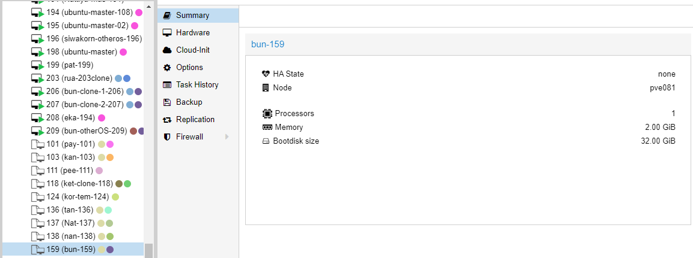
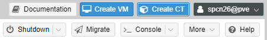

# SPCN-011
**สร้าง VM and CT on Proxmox Cluster**
- [create master vm (ubuntu-22.04)](#createmtvm)
    - [master vm import SSH identity from Github](#github)
    - [clone master vm to tamplate](#clonemt)
    - [clone from template](#clone)
        - [change hostname](#changeht)
        - [local time update](#date)
        - [watch](#watch)
        - [Extra_01 (QEMU Agent and Change IP Address)](#extra)
    - [capture summary screen of 3 vm](vmsum)
    - [capture watch screen 2 vm](watchsum)
- [create vm from other os](#createvmos)
- [create container template (select from CT list)](#createct)

<a name="createmtvm"></a>
## create master vm (ubuntu-22.04)

1. ทำการล็อคอินเว็บไซต์ Proxmox และทำการกดปุ่ม Create VM ด้านขวาบน
<p align="center"></p>

2. ในหัวข้อ Generalกรอกชื่อเครื่องและตั้ง Resource Pool เป็น Special_CN เพื่อเรียกใช้ทรัพยากร
<p align="center"></p>

3. ในหัวข้อ OS ให้เลือก ISO Image เป็น ubuntu-22.04.01-live-server เพื่อเป็นไฟล์ในการติดตั้ง OS
<p align="center"></p>

4. ในหัวข้อ System ให้ทำการติ๊กถูก Qemu Agent ไว้แลกเปลี่ยนข้อมูลระหว่าง Host กับ Guest
<p align="center"></p>

5. ในหัวข้อ Disks จะใช้ Storage ของ Machine โดยตรงโดยเลือก Storage เป็น cept-std
<p align="center"></p>

6. ที่เหลือจะตั้งค่าเป็น Default ทั้งหมดและสามารถกด Finish เพื่อสร้าง Master VM ขึ้นมาได้เลย
<p align="center"></p>

<p align="center"></p>

<p align="center"></p>

<p align="center"></p>

<a name="github"></a>
### master vm import SSH identity from Github
ในระหว่างการ Install จะทำการเปิด OpenSSH เพื่อเพิ่มความปลอดภัยต่อการใช้ SSH โดยจะรับ Public Key ของ GitHub มาเก็บไว้
<p align="center"></p>

ระหว่างนั้นรอซักครู่ เสร็จแล้วลอง Log In เข้าใน SSH ของ OS ที่ติดตั้งไว้ ถ้าเข้าได้ปกติก็เป็นอันเสร็จสิ้นการติดตั้ง OS และเข้าสู่การทำ Template ได้เลย
<p align="center"></p>

<a name="clonemt"></a>
### clone master vm to tamplate

เราจะใช้ตัว VM จากการสร้างเมื่อซักครู่ แปลงเป็น Template โดยการคลิกขวาที่ตัว VM แล้วกด Convert to template และยืนยันเป็นอันเสร็จสิ้น
<p align="center"></p>

<p align="center"></p>

<a name="clone"></a>
### clone from template
1. หลังจากที่ทำ Master VM เสร็จแล้วนั้น ให้ทำการคลิกขวาที่ Master VM แล้วทำการกด Clone
<p align="center"></p>

2. ให้ทำการตั้งชื่อและตั้ง Resource Pool และกด Clone จำนวนสองตัว
<p align="center"></p>

<p align="center"></p>

3. ทำการ Setting ทีละเครื่องในขั้นตอนต่อไป เพื่อไม่ให้ IP ชนกัน

<a name="changeht"></a>
#### change hostname

ในการเปลี่ยนชื่อ Hostname จะใช้คำสั่งดังนี้
```md
sudo hostnamectl set-hostname [username ที่ต้องการ]
```

<a name="date"></a>
#### local time update

ในการเปลี่ยน Timezone และเวลา จะใช้คำสั่งดังนี้
```md
sudo timedatectl set-timezone Asia/Bangkok
```

<a name="watch"></a>
#### watch
ใช้ watch เพื่อดูการทำงานของคำสั่ง
**คำสั่งที่ใช้ดูมีอะไรบ้าง**
- คำสั่งเช็ค IP Address
```md
ip a
```
- คำสั่งเช็คตารางเส้นทางของ IPv6
```md
ip -6 r
```
- คำสั่งทดสอบ ping จำนวน n ครั้ง ของเว็บ Cisco
```md
ping -c [n] www.cisco.com
```
- คำสั่งตรวจสอบวันเวลาของ System
```md
date
```
ในการใช้คำสั่ง watch นั้นจะตรวจสอบและแสดงภายในหน้าเดียวได้หลายคำสั่ง และสามารถกำหนดการแสดงทุก n วินาทีได้โดยเอาคำสั่งมารวมกัน
```md
watch -n [n] "ip a ; ip -6 r ; ping -c 2 www.cisco.com ; date"
```

<a name="extra"></a>
#### Extra_01 (QEMU Agent and Change IP Address)
ในการติดตั้ง QEMU Guest Agent กรณีที่ไม่ได้เปิด QEMU Agent ใน Options จะใช้คำสั่งดังนี้
```md
sudo apt install qemu-guest-agent         #ติดตั้ง QEMU Guest Agent
sudo systemctl start qemu-guest-agent     #เริ่มใช้งาน QEMU Guest Agent
sudo systemctl status qemu-guest-agent    #เช็คสถานะของ QEMU Guest Agent 
```

และ VM ที่ทำการโคลนมาทั้งสองตัวนั้น IP ต้องไม่ซ้ำ เพื่อสามารถใช้งานพร้อมกันได้ วิธีการมีดังนี้
```md
sudo -i                                           #เข้า root
rm /var/lib/dbus/machine-id     
nano /etc/machine-id                              #เข้า nano เพื่อลบข้อมูลทั้งหมดใน machine-id และบันทึก
ln -s /etc/machine-id /var/lib/dbus/machine-id    #Link ข้อมูลในไฟล์ machine-id
reboot                                            #Reboot ให้ระบบ
```
<a name="vmsum"></a>
### capture summary screen of 3 vm
bun-clone-1-206 (IP : 172.31.1.109)
<p align="center"></p>

bun-clone-2-207 (IP : 172.31.1.111)
<p align="center"></p>

bun-otherOS-209 (IP : 172.31.1.119)
<p align="center"></p>

<a name="watchsum"></a>
### capture watch screen 2 vm

<p align="center"></p>

<p align="center"></p>

<a name="createvmos"></a>
## create vm from other os

1. เราจะกดที่ Create VM ที่เดิมและทำการตั้งค่าในการสร้าง OS ใหม่
<p align="center"></p>

<p align="center"></p>

2. ในหน้า OS นั้นจะทำการลงเป็น Kali OS โดยเลือกในช่อง ISO Image
<p align="center"></p>

3. ทำการ Finish และทำการติดตั้ง OS ตามปกติ และเปิด QEMU Agent ก่อนทำการ Boot ขึ้น เป็นอันเสร็จสิ้น
<p align="center"></p>

<a name="createct"></a>
## create container template (select from CT list)

1. ในการสร้าง Container Template ให้ทำการคลิกที่ Create CT
<p align="center"></p>

2. ทำการตั้งชื่อ Hostname, รหัสผ่าน, Resource Pool และทำการกำหนด **[SSH public key](https://www.youtube.com/watch?v=WgZIv5HI44o)** เพื่อเพิ่มความปลอดภัยต่อการใช้ SSH โดยกดที่ Load SSH Key File และเลือกไฟล์ id_rsa.pub
<p align="center"></p>

3. ในหน้า OS จะใช้ ubuntu-22.04-standard เป็น OS ให้กับ CT
<p align="center"></p>

4. ในหน้า Storage จะใช้ Storage เป็น cept-std
<p align="center"></p>

5. ในหน้า Network ส่วนของ IPv4 จะเลือกเป็น DHCP เพื่อให้จัดการและกำหนดค่า IP อัตโนมัติ และในส่วนของ IPv6 เป็น SLAAC เพื่อใช้กำหนดสร้างและกำหนดค่าที่อยู่ของ IPv6 ด้วยตนเอง
<p align="center"></p>

6. กด Finish และลอง Boot ตั้ง timezone ให้ตรงและ ทดสอบคำสั่ง watch เป็นอันเสร็จสิ้น (ผลลัพธ์ที่ได้ จะเร็วกว่าตัว VM ธรรมดาเพราะมีการบริโภคทรัพยากรน้อยกว่า)
<p align="center"></p>

<p align="center"></p>